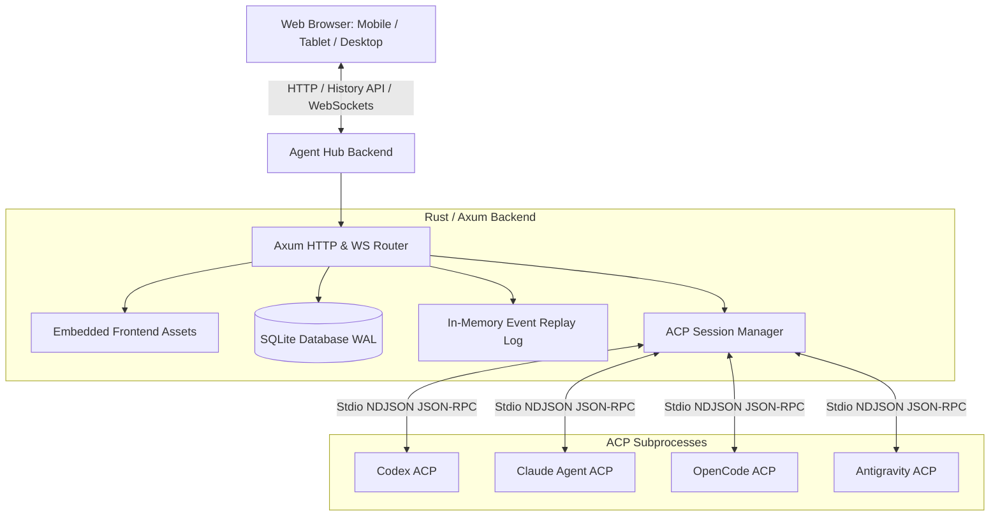

# Agent Hub Architecture

## 1. Overview

Agent Hub is a single-owner, persistent web supervisor for local ACP (Agent Client Protocol) coding agents (such as Codex, Claude, OpenCode, and Antigravity). It provides a full web interface adhering to modern Material 3 design and adaptive layout conventions, managing persistent projects, chats, ACP streaming, permissions, configuration, archive/delete, and process lifecycles.

The backend is written in Rust using `tokio` and `axum`. The frontend is a standalone Angular application written in TypeScript, using Angular Material/CDK primitives and Angular Router. Angular produces production-hashed static assets that are embedded directly into the Rust binary with `rust-embed`.

## 2. System Architecture

## 3. Core Modules

### 3.1. Subprocess ACP Layer (`src/acp/`)
- **Transport**: Standard I/O NDJSON JSON-RPC communication with local ACP agents.
- **Client Protocol**: Handles ACP handshake, session initialization (`session/new`, `session/load`, `session/resume`), tool execution, plan updates, and terminal/filesystem callbacks.
- **Title Synchronization**: Monitors `session_info_update` and syncs agent-generated chat titles to SQLite if not manually overridden.
- **Permission Callbacks**: Enforces permission policies (`ask`, `read-only`, `auto-approve`, `deny-all`) for file edits and terminal commands requested by the agent.

### 3.2. Session Lifecycle (`src/session/`)
- **Process Supervision**: Spawns and supervises ACP agent subprocesses on demand.
- **Turn Locking**: Enforces single-turn execution per chat.
- **Process Management**: Idle process reaping (default 900s timeout), graceful stopping via `session/close`, and forced process tree termination.

### 3.3. Persistence & Database (`src/store.rs`)
- **Engine**: SQLite in WAL mode with foreign keys enabled and busy timeouts.
- **Schema**:
  - `projects`: Managed repositories with name and canonical path.
  - `chats`: Chats bound to projects, agents, titles, ACP session IDs, permission policies, and configuration options.
  - `activity`: Persistent session events with strict sequence ordering.

### 3.4. Event Dispatch & WebSockets (`src/events.rs`)
- **Event Log**: Thread-safe in-memory ring buffer storing the latest 10,000 events for fast reconnect and replay.
- **WebSocket Streaming**: Clients subscribe with `from_seq` to seamlessly resume streaming without dropped messages.

### 3.5. Web API & Static Serving (`src/web/`)
- **REST Endpoints**: Projects, filesystem directory browsing, git clone creation, chats, ACP prompts, configuration, and permissions.
- **Static Assets (`src/web/static_files.rs`)**: Serves embedded Angular production assets. Implements long-term cache headers (`Cache-Control: public, max-age=31536000, immutable`) for hashed assets and revalidation headers for `index.html` with SPA History API fallback.

## 4. Frontend Architecture (`frontend/`)

- **Framework**: Angular standalone components with signals, `HttpClient`, Angular Router, and RxJS for WebSocket event streams.
- **UI System**: Angular Material and Angular CDK components, with one Material 3 theme in `src/styles.scss` and small Agent Hub semantic status tokens.
- **Responsive Window Classes**:
  - **Compact (<600px)**: Bottom-sheet style or modal drawer, full-width inputs, touch targets >= 48px, `env(safe-area-inset-bottom)`.
  - **Medium (600–839px)**: Modal drawer navigation, flexible margins.
  - **Expanded (>=840px)**: Permanent side navigation drawer, dual-pane layout, persistent side sheet for configuration.
- **Routing**: Angular Router supporting `/`, `/projects/:projectId`, and `/projects/:projectId/chats/:chatId`, including the Rust SPA fallback for deep links.
- **State Management**: Signal-based application store (`src/app/state/app-state.service.ts`) and pure event reducer (`src/app/state/event-reducer.ts`) handling turns, thoughts, tools, plans, and permissions.
- **Packaging**: Built reproducibly with Nix via `buildNpmPackage` from `dist/browser` and embedded in Rust for zero-dependency, single-service deployment.
